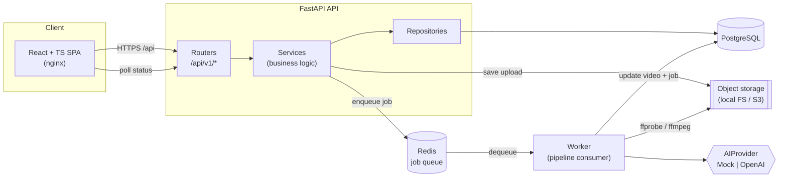
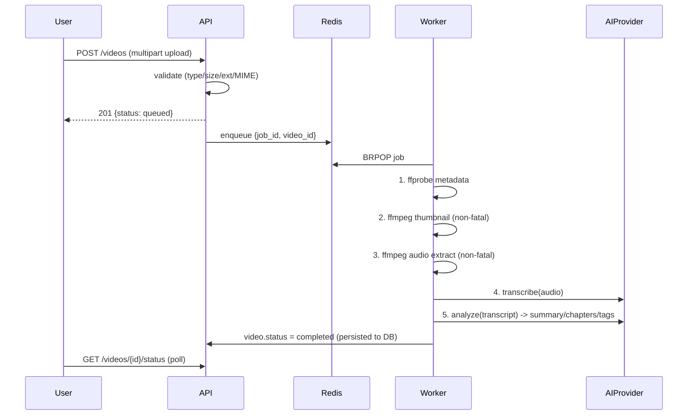
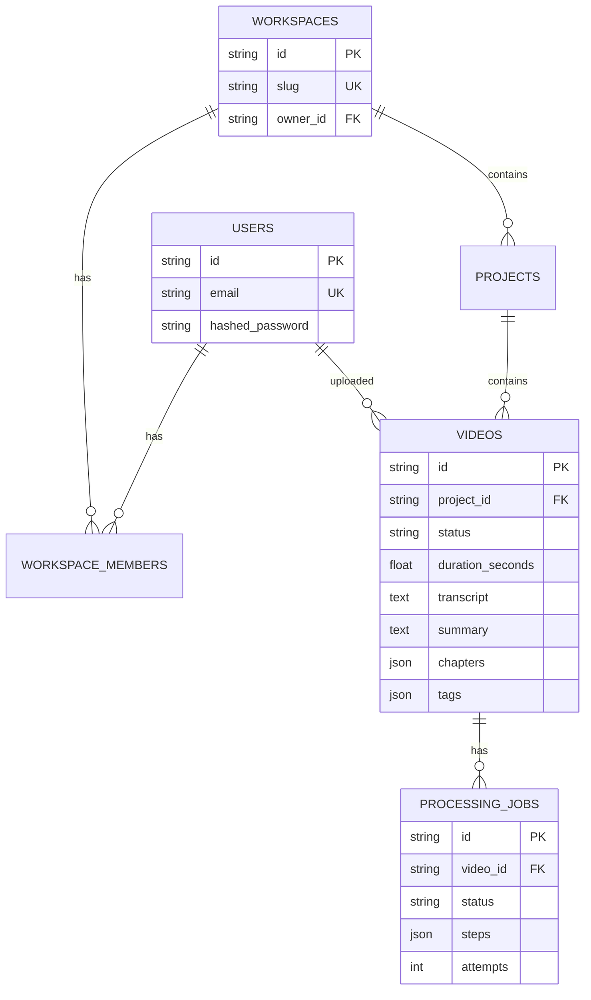
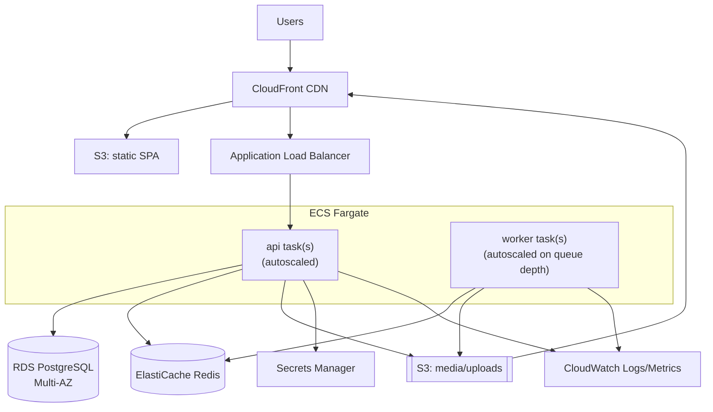

# ClipForge — AI Video Processing & Content Intelligence Platform

> **Built as a production-style portfolio project** by Derrick Adjei.
> Not a live commercial product — there are no real users, revenue, or uptime
> claims. Every number in this README is either a configuration value or a local
> test result.

ClipForge is a media SaaS backend (with a polished React dashboard) that ingests
videos and turns them into structured content intelligence: extracted technical
metadata, thumbnails, an audio track, a transcript, and AI‑generated summary,
chapters, and tags. Processing happens **asynchronously** through a Redis‑backed
worker so the API stays responsive under load.

It runs **fully offline in demo mode** — the `MockAIProvider` produces realistic,
deterministic AI output with no API key or network access, so the entire
`upload → queue → process → AI results` path works out of the box.

---

## Table of contents

1. [Demo](#demo)
2. [Architecture](#architecture)
3. [Tech stack](#tech-stack)
4. [Features](#features)
5. [API](#api)
6. [Database](#database)
7. [AI provider abstraction](#ai-provider-abstraction)
8. [Running locally](#running-locally)
9. [Environment variables](#environment-variables)
10. [Testing](#testing)
11. [Docker](#docker)
12. [Deployment (AWS architecture)](#deployment-aws-architecture)
13. [Engineering decisions](#engineering-decisions)
14. [Future improvements](#future-improvements)
15. [Project layout](#project-layout)

---

## Demo

The fastest way to see the whole thing:

```bash
cd projects/clipforge
cp .env.example .env
docker compose up --build
```

Then open:

- **Frontend:** http://localhost:8080
- **API docs (OpenAPI/Swagger):** http://localhost:8000/docs
- **Health / readiness:** http://localhost:8000/health · http://localhost:8000/ready

The API container runs migrations and seeds a **demo account** with sample
completed videos on first boot:

```
email:    demo@clipforge.dev
password: demo12345
```

**Demo flow to try:** sign in → **Upload** a video → watch the detail page show a
live pipeline checklist (metadata → thumbnail → audio → transcript → AI) → see
the AI summary, chapters, and tags appear when it completes. Search the library
by transcript text.

> Because demo mode uses the deterministic `MockAIProvider`, transcripts/summaries
> are synthetic. Set `AI_PROVIDER=openai` and `OPENAI_API_KEY=...` for real
> Whisper transcription + LLM analysis.

---

## Architecture

ClipForge separates the **synchronous request path** (auth, uploads, reads) from
the **asynchronous processing path** (the heavy media/AI work), connected by a
Redis queue.



**Clean architecture, inward dependencies only:**

```
api  ->  services  ->  repositories  ->  models
                \->  ai (protocol)   \->  (SQLAlchemy)
```

- **Routers** (`app/api`) — HTTP concerns only: parse/validate, call a service,
  serialize a schema.
- **Services** (`app/services`) — business logic and orchestration; framework‑
  agnostic and unit‑testable.
- **Repositories** (`app/repositories`) — all query/ORM logic, keeping SQL out of
  services.
- **AI abstraction** (`app/services/ai`) — a `Protocol` the pipeline depends on;
  concrete providers are swapped by a factory.
- **Worker** (`app/workers`) — a standalone process running the same
  `ProcessingPipeline` used in tests.

### Processing pipeline (per video)



Each stage records its own status on the job (`steps`) so the UI renders a live
checklist. Thumbnail/audio failures are **non‑fatal** — a single undecodable file
never blocks AI insights, and the pipeline degrades gracefully when ffmpeg is
absent.

---

## Tech stack

| Layer          | Technology                                                            |
| -------------- | -------------------------------------------------------------------- |
| Backend        | Python 3.12, FastAPI, Uvicorn                                        |
| Data           | SQLAlchemy 2.0 (typed ORM), PostgreSQL, Alembic migrations          |
| Validation     | Pydantic v2 + pydantic‑settings                                     |
| Auth           | JWT access/refresh (PyJWT), bcrypt password hashing (passlib)       |
| Async / queue  | Redis list queue, standalone worker process                        |
| Media          | ffmpeg / ffprobe (metadata, thumbnails, audio)                     |
| AI             | `AIProvider` protocol → `OpenAIProvider` (Whisper + chat) / `MockAIProvider` |
| Observability  | structlog (JSON logs), request IDs, `/health` + `/ready` probes    |
| Hardening      | CORS, SlowAPI rate limiting, upload validation, non‑root containers |
| Frontend       | React 18, TypeScript, Vite, React Router                           |
| Testing        | pytest (+coverage), Vitest + Testing Library                       |
| Quality        | Ruff, mypy, ESLint, Prettier                                       |
| Infra          | Docker, docker‑compose, GitHub Actions                            |

---

## Features

- **JWT auth** — register/login with access + refresh tokens; transparent token
  refresh on the client; bcrypt hashing.
- **Workspaces & projects** — every user gets a default workspace on signup;
  membership‑scoped authorization on all reads/writes.
- **Validated uploads** — extension, MIME type, size, and empty‑file checks, with
  defence‑in‑depth re‑validation against bytes actually written.
- **Async processing pipeline** — metadata (ffprobe), thumbnail + audio (ffmpeg),
  transcript, and AI summary/chapters/tags, dispatched via Redis.
- **AI provider abstraction** — real OpenAI or fully offline mock (demo mode).
- **Search & filtering** — search across title/summary/transcript, filter by
  status/project, paginated.
- **Dashboard stats** — totals, duration, storage, status breakdown, recents.
- **Live status** — job step checklist with client polling until completion.
- **Operational endpoints** — OpenAPI docs, `/health`, `/ready`, structured logs,
  request IDs, consistent error envelope.
- **Polished dark UI** — responsive SaaS media‑tool look (charcoal/slate + amber),
  with loading/error/empty states throughout.

---

## API

Interactive docs live at `/docs` (Swagger) and `/redoc`. All app routes are under
`/api/v1`.

| Method   | Path                                    | Description                                  | Auth |
| -------- | --------------------------------------- | -------------------------------------------- | ---- |
| `POST`   | `/api/v1/auth/register`                 | Create account (+ default workspace)         | —    |
| `POST`   | `/api/v1/auth/login`                    | Get access + refresh tokens                  | —    |
| `POST`   | `/api/v1/auth/refresh`                  | Exchange refresh token for new tokens        | —    |
| `GET`    | `/api/v1/auth/me`                       | Current user                                 | ✔    |
| `GET`    | `/api/v1/workspaces`                    | List my workspaces                           | ✔    |
| `POST`   | `/api/v1/workspaces`                    | Create workspace                             | ✔    |
| `GET`    | `/api/v1/workspaces/{id}/projects`      | List projects in a workspace                 | ✔    |
| `POST`   | `/api/v1/workspaces/{id}/projects`      | Create project                               | ✔    |
| `POST`   | `/api/v1/videos`                        | Upload a video (multipart) → enqueue job     | ✔    |
| `GET`    | `/api/v1/videos`                        | Search/filter/paginate videos                | ✔    |
| `GET`    | `/api/v1/videos/{id}`                   | Video detail (metadata + AI results)         | ✔    |
| `PATCH`  | `/api/v1/videos/{id}`                   | Update (e.g. title)                          | ✔    |
| `DELETE` | `/api/v1/videos/{id}`                   | Delete video + assets                        | ✔    |
| `GET`    | `/api/v1/videos/{id}/status`            | Latest processing job + step progress        | ✔    |
| `POST`   | `/api/v1/videos/{id}/reprocess`         | Re‑enqueue processing                        | ✔    |
| `GET`    | `/api/v1/dashboard/stats`               | Aggregate dashboard stats                    | ✔    |
| `GET`    | `/health`                               | Liveness probe                               | —    |
| `GET`    | `/ready`                                | Readiness (DB + Redis reachability)          | —    |

Errors use a consistent envelope:

```json
{ "error": { "code": "not_found", "detail": "Video not found" } }
```

---

## Database



- Schema is managed with **Alembic** (`alembic upgrade head`). The initial
  migration is dialect‑aware and uses `JSONB` on PostgreSQL.
- Indexes on foreign keys plus `videos.status` and `videos.title` support the
  library search/filter paths.
- JSON columns (`chapters`, `tags`, `steps`) store semi‑structured pipeline output.

---

## AI provider abstraction

The pipeline depends only on a `Protocol`, never on a vendor SDK:

```python
class AIProvider(Protocol):
    name: str
    def transcribe(self, audio_path: str, *, duration_seconds: float | None = None) -> Transcript: ...
    def analyze(self, transcript: str, *, title: str, duration_seconds: float | None = None) -> ContentInsights: ...
```

- **`MockAIProvider`** — deterministic, offline. Powers demo mode and tests.
- **`OpenAIProvider`** — Whisper transcription + a JSON‑constrained chat model for
  summary/chapters/tags, wrapped in retries.
- **`get_ai_provider()`** — a factory that selects OpenAI only when a key is
  configured and **falls back to mock** otherwise, so the AI path never breaks.

This makes the interesting business logic (the pipeline) testable without network
access, and makes swapping AI vendors a one‑line change.

---

## Running locally

### Option A — Docker (recommended)

See [Demo](#demo). One command brings up API, worker, frontend, Postgres, and Redis.

### Option B — Run services directly

**Backend** (needs `ffmpeg` on PATH; PostgreSQL + Redis optional — it degrades to
an in‑memory queue and you can use SQLite):

```bash
cd projects/clipforge/backend
pip install -r requirements-dev.txt
cp ../.env.example .env            # edit as needed

# Use SQLite for a zero-dependency run, or point DATABASE_URL at Postgres
export DATABASE_URL="sqlite+pysqlite:///./clipforge.db"
python -m scripts.seed             # demo user + sample videos
uvicorn app.main:app --reload      # http://localhost:8000/docs
```

Run the worker in a second terminal (requires Redis for the real queue):

```bash
cd projects/clipforge/backend
python -m app.workers.processor
```

**Frontend:**

```bash
cd projects/clipforge/frontend
npm install
npm run dev                        # http://localhost:5173 (proxies /api to :8000)
```

---

## Environment variables

All configuration is env‑driven (see [`.env.example`](.env.example)). Highlights:

| Variable                       | Default                          | Purpose                                        |
| ------------------------------ | -------------------------------- | ---------------------------------------------- |
| `ENVIRONMENT`                  | `development`                    | Toggles JSON logs / prod behavior              |
| `SECRET_KEY`                   | `dev-insecure-change-me`         | JWT signing key — **set a strong value**       |
| `DATABASE_URL`                 | local Postgres                   | SQLAlchemy connection string                   |
| `REDIS_URL`                    | `redis://localhost:6379/0`       | Queue / cache                                  |
| `STORAGE_DIR`                  | `./storage`                      | Local object storage root                      |
| `MAX_UPLOAD_BYTES`             | `524288000` (500 MB)             | Upload size cap                                |
| `AI_PROVIDER`                  | `mock`                           | `mock` (offline) or `openai`                   |
| `OPENAI_API_KEY`               | _(empty)_                        | Enables real AI when set                       |
| `CORS_ORIGINS`                 | localhost dev origins            | Comma‑separated allowlist                      |
| `RATE_LIMIT_DEFAULT`           | `120/minute`                     | Global rate limit                              |
| `SEED_ON_START`                | `true` (compose)                 | Seed demo data on API container boot           |

No secrets are committed. `.env` is git‑ignored; only `.env.example` is tracked.

---

## Testing

**Backend** — pytest against in‑memory SQLite and an in‑memory queue (no external
services needed). Includes unit tests (security, AI mock, upload validation),
API integration tests (auth, videos, dashboard, health), and full
**pipeline tests with `MockAIProvider`** (success, step progress, failure path).

```bash
cd projects/clipforge/backend
DATABASE_URL="sqlite+pysqlite:///:memory:" SECRET_KEY=test pytest -q
ruff check .        # lint
mypy app            # type-check
```

_Latest local run: **34 passed**, `ruff` clean, `mypy` clean (54 files)._

**Frontend** — Vitest + Testing Library component/unit tests.

```bash
cd projects/clipforge/frontend
npm run test        # 11 passed
npm run lint
npm run build
```

An end‑to‑end sanity path (register → upload a real MP4 → run the pipeline →
verify metadata/thumbnail/audio/transcript/summary/chapters/tags) was validated
locally against actual `ffmpeg`/`ffprobe`.

---

## Docker

- `backend/Dockerfile` — Python 3.12‑slim + ffmpeg, non‑root user, healthcheck.
- `frontend/Dockerfile` — multi‑stage Node build served by nginx, which also
  reverse‑proxies `/api` and `/media` to the API.
- `docker-compose.yml` — five services: `postgres`, `redis`, `api`, `worker`,
  `frontend`, with health‑gated startup ordering and shared storage volume.

```bash
docker compose up --build      # from projects/clipforge/
docker compose logs -f worker  # watch processing
docker compose down -v         # tear down + wipe volumes
```

---

## Deployment (AWS architecture)

> Documented, **not provisioned** — no live cloud resources are created. This maps
> the local components to a realistic AWS deployment.



| Local component        | AWS service                    | Notes                                             |
| ---------------------- | ------------------------------ | ------------------------------------------------- |
| Local FS `storage/`    | **S3**                         | `LocalStorage` is the seam; swap for an S3 client |
| Media delivery         | **CloudFront** + S3 signed URLs| `LocalStorage.public_url()` becomes signed URLs   |
| PostgreSQL container   | **RDS PostgreSQL (Multi‑AZ)**  | Managed backups/failover                          |
| Redis container        | **ElastiCache for Redis**      | Queue + cache                                     |
| `api` container        | **ECS Fargate** behind an ALB  | Autoscale on CPU/RPS; `/health` + `/ready` probes |
| `worker` container     | **ECS Fargate service**        | Autoscale on Redis queue depth                    |
| Frontend (nginx)       | **S3 + CloudFront**            | Static SPA hosting                                |
| Secrets/env            | **Secrets Manager / SSM**      | `SECRET_KEY`, `OPENAI_API_KEY`, DB creds          |
| Logs/metrics           | **CloudWatch**                 | JSON logs already emitted via structlog           |

Storage is the only code seam that changes for cloud; everything else is
config. A future queue upgrade would move from a Redis list to **SQS** for
managed retries/DLQ (see below).

---

## Engineering decisions

- **Queue over background tasks.** Media/AI work is offloaded to a dedicated
  worker via Redis so the API never blocks on ffmpeg or model latency, and
  workers scale independently of the API.
- **Provider abstraction for AI.** Depending on a `Protocol` (not the OpenAI SDK)
  keeps the pipeline unit‑testable and vendor‑swappable, and enables a genuinely
  functional offline demo instead of stubbed 501s.
- **Clean layering.** Routers → services → repositories → models keeps SQL out of
  business logic and business logic out of HTTP handlers, so each layer is tested
  in isolation.
- **Graceful degradation.** ffmpeg/ffprobe missing or a bad file? Those steps are
  marked `skipped`/`failed` and the pipeline continues. Redis down? The API falls
  back to an in‑memory queue so reads/writes keep working.
- **Membership‑scoped queries.** Authorization is enforced at the repository layer
  (every video query joins through workspace membership), preventing horizontal
  access bugs.
- **Config as env.** One image, many environments; secrets never live in code.
- **Portable persistence.** A `JSONType` renders `JSONB` on Postgres and `JSON` on
  SQLite, so the same models power fast in‑memory tests and production.

---

## Future improvements

- **SQS + DLQ** instead of a Redis list for managed retries, visibility timeouts,
  and dead‑letter handling; idempotency keys per job.
- **WebSocket/SSE** push for live status instead of client polling.
- **Real streaming playback** (HLS/DASH transcode ladder) and signed URL delivery.
- **Semantic search** over transcripts using embeddings + pgvector.
- **Role‑based access control** and workspace invitations (schema already supports
  member roles).
- **Chunked/resumable uploads** (tus / S3 multipart) for large files.
- **Per‑workspace usage quotas** and rate limits backed by Redis.
- **Observability**: OpenTelemetry traces spanning API → queue → worker.

---

## Project layout

```
projects/clipforge/
├── backend/
│   ├── app/
│   │   ├── api/v1/          # routers (auth, workspaces, videos, dashboard, health)
│   │   ├── core/            # config, security, db, logging, deps, middleware
│   │   ├── models/          # SQLAlchemy models
│   │   ├── schemas/         # Pydantic schemas
│   │   ├── services/        # business logic, pipeline, storage, queue
│   │   │   └── ai/          # AIProvider protocol + Mock/OpenAI providers
│   │   ├── repositories/    # data access
│   │   ├── workers/         # Redis queue consumer
│   │   └── utils/           # ffmpeg/ffprobe helpers
│   ├── alembic/             # migrations
│   ├── scripts/             # seed.py, entrypoint.sh
│   ├── tests/               # pytest suite
│   ├── Dockerfile
│   └── pyproject.toml / requirements*.txt
├── frontend/                # React + TS + Vite SPA
│   ├── src/{api,components,pages,context,lib,types,styles}
│   ├── Dockerfile + nginx.conf
│   └── package.json
├── .github/workflows/       # CI (backend + frontend) — see note below
├── docker-compose.yml
└── .env.example
```

> **CI note:** GitHub only auto‑runs workflows at the **repo root**
> `.github/workflows/`. These workflows live inside the package for
> **extractability** to a standalone repo; to activate them in this monorepo,
> copy/symlink them to the repo‑root `.github/workflows/` (their paths are already
> repo‑root‑relative).
