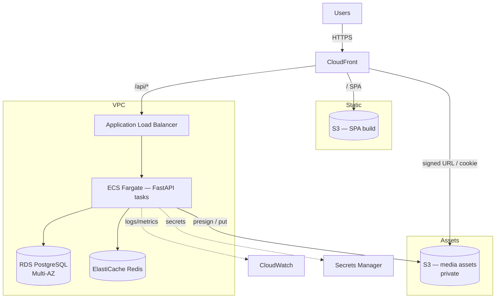

# MediaVault — AWS Deployment Architecture

This is the **target** production architecture. No live AWS infrastructure is
provisioned for this portfolio project; the code is written so that switching
`STORAGE_BACKEND=s3` and pointing `DATABASE_URL`/`REDIS_URL` at managed services
is the only application change required.

## Topology

## Components

| Concern | AWS service | Notes |
|---------|-------------|-------|
| SPA hosting | **S3 + CloudFront** | Fingerprinted assets cached at the edge; SPA fallback to `index.html`. |
| API compute | **ECS Fargate** behind an **ALB** | Stateless FastAPI tasks; scale on CPU/RPS. Health checks hit `/api/v1/ready`. |
| Database | **RDS for PostgreSQL** (Multi-AZ) | Automated backups, PITR; parameter group enables `pg_trgm`. |
| Cache / rate limit | **ElastiCache for Redis** | Optional; token-bucket rate limiting and hot-list caching. |
| Object storage | **S3** (private bucket) | Media assets; server-side encryption (SSE-S3/KMS), versioning, lifecycle rules. |
| Secure delivery | **CloudFront signed URLs/cookies** | Assets are private; the API mints time-limited signed URLs. |
| Secrets | **Secrets Manager / SSM Parameter Store** | `SECRET_KEY`, DB creds, `SIGNED_URL_SECRET`. Never in images. |
| Observability | **CloudWatch** | JSON logs shipped from tasks; dashboards + alarms on 5xx, latency, DB connections. |
| CI/CD | **GitHub Actions → ECR → ECS** | Build/test, push images to ECR, rolling ECS deploy. |

## Asset upload & delivery flow

1. A `MEMBER`/`ADMIN` uploads through the API. The task validates content type +
   size, computes a checksum, and `PutObject`s to the private S3 bucket
   (`workspace_id/asset_id/filename`).
2. To view/download, the client asks the API for a signed URL. With the S3
   backend the API returns a **presigned GET** (or a CloudFront signed URL);
   bytes are served directly from S3/edge, never proxied through the API.
3. Signatures are short-lived (`SIGNED_URL_EXPIRE_SECONDS`), so links expire and
   cannot be forged.

## Security posture

- Private subnets for ECS/RDS/ElastiCache; only the ALB (and CloudFront) are
  public. Security groups scope traffic API→DB/Redis.
- S3 buckets block public access; delivery only via signed URLs/cookies.
- TLS everywhere (ACM certs on CloudFront/ALB).
- Least-privilege IAM task role (scoped S3 actions on one bucket prefix).
- Secrets injected at runtime from Secrets Manager; rotation supported.

## Scaling & resilience

- **Stateless API** → horizontal scaling via ECS service auto-scaling.
- **RDS Multi-AZ** for failover; read replicas if read load grows.
- **S3 + CloudFront** absorb asset-delivery load off the API.
- Idempotent migrations run as a one-off ECS task (or init container) before
  rolling out new task revisions.

## Cost-conscious notes

For a demo/free-tier footprint you can collapse this to: a single small ECS task
(or an EC2/Lightsail instance) running the Docker Compose stack, an RDS `db.t4g.micro`,
and one S3 bucket — retaining the same application code and signed-URL model.
