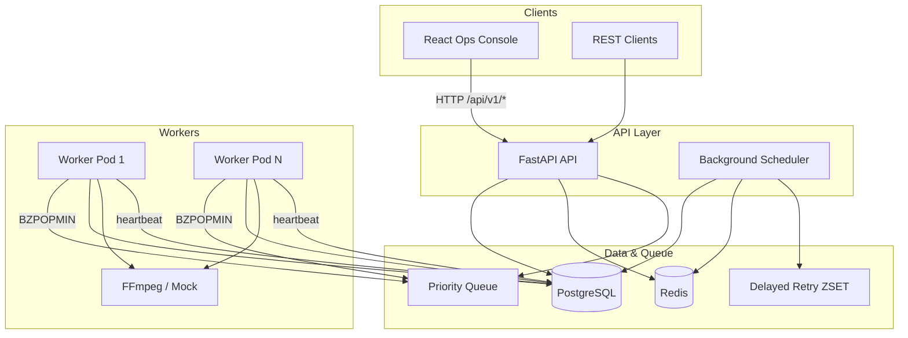

# RenderFlow

Distributed media processing platform: submit jobs via REST, track them in an ops console, and scale FFmpeg workers horizontally behind a Redis priority queue.

## Architecture



### Job lifecycle

1. **Submit** — `POST /api/v1/jobs` persists the job and pushes its ID onto the Redis priority queue.
2. **Claim** — a worker atomically transitions `queued` → `processing` in Postgres.
3. **Process** — FFmpeg (or mock adapter in CI/dev) writes output to shared storage.
4. **Complete / retry** — success marks `completed`; transient failures schedule exponential backoff via the delayed queue; exhausted retries land in `failed` (dead letter).
5. **Reap** — the API scheduler requeues jobs whose worker heartbeat timed out.

## Quick start (Docker Compose)

```bash
cp .env.example .env
docker compose up --build
```

| Service  | URL                         |
|----------|-----------------------------|
| Frontend | http://localhost:3000       |
| API      | http://localhost:8000/docs  |
| Postgres | localhost:5432              |
| Redis    | localhost:6379              |

Scale workers:

```bash
docker compose up --scale worker=4 -d
```

## Local development

### API + worker (Python)

```bash
python -m venv .venv && source .venv/bin/activate
pip install -e common -r api/requirements.txt -r worker/requirements.txt

# Start Postgres + Redis (or use docker compose up postgres redis -d)
cp .env.example .env

cd api && alembic upgrade head
uvicorn app.main:app --reload --port 8000

# Separate terminal
cd worker && python -m worker.main
```

### Frontend

```bash
cd frontend
npm ci
npm run dev   # http://localhost:5173 — proxies /api to :8000
```

## API routes

| Method | Path | Description |
|--------|------|-------------|
| `GET` | `/health/live` | Liveness (process up) |
| `GET` | `/health/ready` | Readiness (Postgres + Redis) |
| `POST` | `/api/v1/jobs` | Submit job (idempotent with `idempotency_key`) |
| `GET` | `/api/v1/jobs` | List jobs (`status`, `job_type`, pagination) |
| `GET` | `/api/v1/jobs/stats` | Aggregate counts |
| `GET` | `/api/v1/jobs/{id}` | Job detail |
| `POST` | `/api/v1/jobs/{id}/retry` | Re-queue failed job |
| `POST` | `/api/v1/jobs/{id}/cancel` | Cancel pending/queued job |
| `GET` | `/api/v1/workers` | Worker registry |

## Kubernetes

Apply manifests (adjust namespace as needed):

```bash
kubectl create namespace renderflow
kubectl apply -f k8s/configmap.yaml
kubectl apply -f k8s/secret.yaml          # from secret.yaml.example
kubectl apply -f k8s/postgres-placeholder.yaml   # dev only — use RDS in prod
kubectl apply -f k8s/redis-deployment.yaml
kubectl apply -f k8s/api-deployment.yaml
kubectl apply -f k8s/api-service.yaml
kubectl apply -f k8s/worker-deployment.yaml
kubectl apply -f k8s/hpa-worker.yaml
```

Build and load images (example for kind/minikube):

```bash
docker build -f api/Dockerfile -t renderflow-api:latest .
docker build -f worker/Dockerfile -t renderflow-worker:latest .
```

### Health probes

Kubernetes uses two probe types with different goals:

| Probe | Endpoint / check | Purpose |
|-------|------------------|---------|
| **Liveness** (`/health/live`) | Returns `{"status":"ok"}` without touching Postgres or Redis | Restarts the pod if the Python process is wedged. Does **not** check dependencies — a slow DB should not kill a healthy API process. |
| **Readiness** (`/health/ready`) | Pings Postgres (`SELECT 1`) and Redis (`PING`) | Removes the pod from Service endpoints until dependencies are reachable. Traffic is not routed to unready pods. |

Worker pods have no HTTP server. Their **liveness** probe uses `pgrep` to confirm the worker process is running. Workers do not need a readiness probe because they pull from Redis rather than receive inbound traffic.

The API Deployment sets both probes on port 8000. The worker HPA scales on CPU utilization (70% target, 2–20 replicas).

## AWS / EKS deployment sketch

Recommended production layout on AWS:

| Component | AWS service |
|-----------|-------------|
| Postgres | **Amazon RDS** or **Aurora PostgreSQL** — set `DATABASE_URL` via External Secrets |
| Redis | **Amazon ElastiCache for Redis** — update `REDIS_URL` in ConfigMap |
| Media storage | **Amazon S3** — mount via CSI or pre-signed URLs (swap `MEDIA_STORAGE_PATH` integration) |
| API + workers | **EKS** Deployments with IRSA for S3 access |
| Secrets | **AWS Secrets Manager** + [External Secrets Operator](https://external-secrets.io/) (see `k8s/secret.yaml.example`) |
| Ingress | **AWS Load Balancer Controller** → `renderflow-api` Service |
| Autoscaling | Worker HPA + **Karpenter** or Cluster Autoscaler for node capacity |

Example EKS flow:

1. Create EKS cluster, RDS instance, ElastiCache cluster.
2. Store `DATABASE_URL` and `POSTGRES_PASSWORD` in Secrets Manager.
3. Install External Secrets Operator; apply ExternalSecret manifest from `k8s/secret.yaml.example`.
4. Push images to ECR; update Deployment `image` fields.
5. Apply ConfigMap with production `REDIS_URL` and `CORS_ORIGINS`.
6. Use EFS or S3 for shared media volume across worker pods.

## Project layout

```
renderflow/
├── api/           FastAPI service + Alembic migrations
├── worker/        Job consumer (FFmpeg)
├── common/        Shared models, schemas, config
├── frontend/      React + TypeScript ops console
├── k8s/           Kubernetes manifests
├── docker-compose.yml
└── .github/workflows/renderflow-ci.yml   # at repo root
```

## Testing

```bash
source .venv/bin/activate
pip install -e common -r api/requirements.txt -r worker/requirements.txt pytest
cd api && pytest
cd ../worker && FORCE_MOCK_FFMPEG=1 pytest
cd ../frontend && npm ci && npm run build
```

## License

MIT
