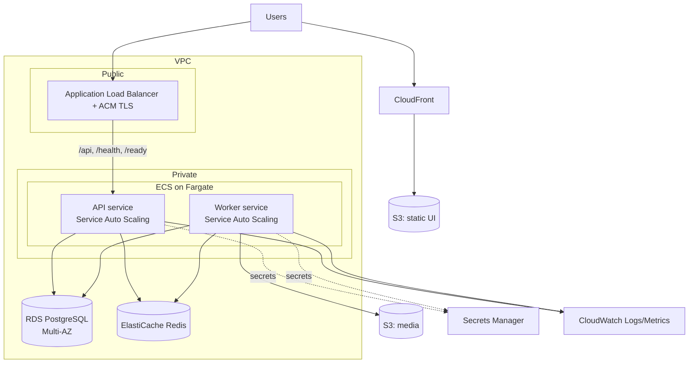
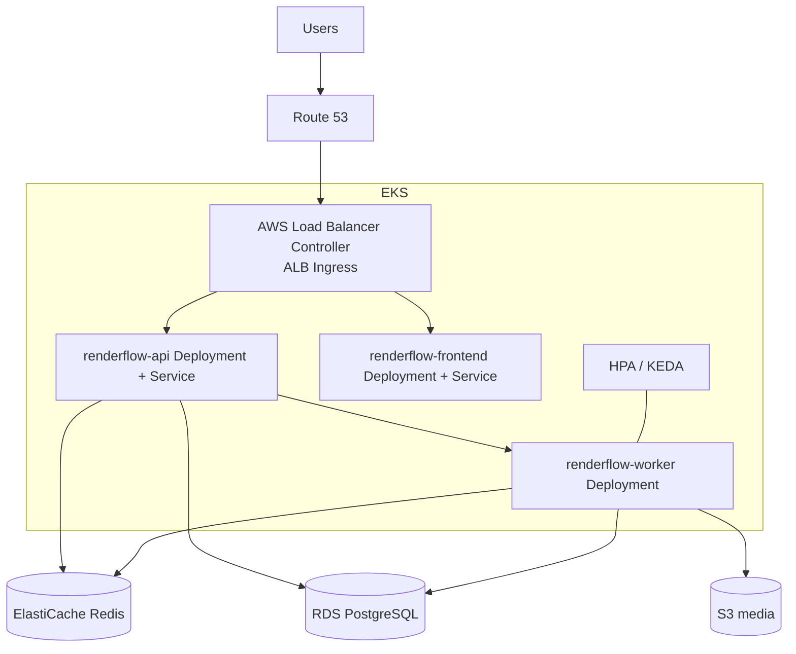

# RenderFlow on AWS — Reference Architecture

> **Design reference only.** Nothing here is provisioned by this repository, and
> running RenderFlow locally (Docker Compose) or on any Kubernetes cluster does
> not require any AWS account or spend. This document shows how the same
> components map onto managed AWS services for a production deployment.

RenderFlow's clean separation — stateless API, stateless workers, a queue, a
relational store, and object storage — maps almost 1:1 onto managed AWS
services. Below are two deployment options (ECS and EKS) plus the shared data
plane.

---

## Shared data plane (both options)

| RenderFlow component | AWS service | Notes |
|----------------------|-------------|-------|
| PostgreSQL | **Amazon RDS for PostgreSQL** (or **Aurora**) | Multi-AZ for HA; the app just needs the DSN in a secret |
| Redis queue | **Amazon ElastiCache for Redis** | Managed, multi-AZ; or migrate to **SQS** (see below) |
| Object storage | **Amazon S3** | `RENDERFLOW_STORAGE_BACKEND=s3`; workers use IAM roles, not keys |
| Secrets | **AWS Secrets Manager / SSM Parameter Store** | DB DSN, etc. injected as env vars |
| Logs | **CloudWatch Logs** | JSON logs parse into structured fields automatically |
| Metrics/alerts | **CloudWatch Metrics + Alarms** | Alarm on failed-job rate, queue depth, worker count |
| CDN (frontend) | **CloudFront + S3** | Static UI served from S3 behind CloudFront |
| Ingress/TLS | **Application Load Balancer + ACM** | TLS termination; routes `/api` → API, `/` → UI |

### Queue: ElastiCache Redis vs. SQS

The app talks to a `JobQueue` interface, so either works:

- **ElastiCache for Redis** — drop-in; keeps the exact priority + delayed-retry
  semantics implemented today (`RENDERFLOW_REDIS_URL` points at the cluster).
- **Amazon SQS** — a managed alternative. SQS provides native **visibility
  timeouts** (map to job leases), **delay queues / per-message delay** (map to
  backoff), a **dead-letter queue** (maps to terminally-failed jobs), and
  effectively infinite scale with no cluster to operate. Priority would be
  modelled with multiple queues (e.g. `high`/`default`) since SQS has no
  intrinsic priority. Implementing an `SqsQueue` behind the existing interface is
  the only code change required.

---

## Option 1 — Amazon ECS (Fargate)



- **API** runs as an ECS Fargate service behind the ALB. ALB target-group
  health checks hit `/ready`; container health checks hit `/health`.
- **Workers** run as a separate Fargate service with **Service Auto Scaling** —
  scale on a CloudWatch metric such as ElastiCache `CurrConnections`/CPU, or a
  custom **queue-depth** metric published from the app (recommended).
- **Static UI** in S3 behind CloudFront; ALB path rules route `/api` to the API.
- **Fargate** means no EC2 to manage; FFmpeg-heavy workers get larger task sizes.

---

## Option 2 — Amazon EKS (Kubernetes)

The manifests in [`../k8s`](../k8s) deploy directly to EKS with minimal changes:



Changes vs. the demo manifests:

1. **Drop** `postgres.yaml` and `redis.yaml`; point `RENDERFLOW_DATABASE_URL`
   (Secret) and `RENDERFLOW_REDIS_URL` (ConfigMap) at **RDS** and
   **ElastiCache** endpoints. This is the "external DB pattern" the manifests
   already document.
2. **Storage:** set `RENDERFLOW_STORAGE_BACKEND=s3` and `RENDERFLOW_S3_BUCKET`.
   Grant workers S3 access via **IRSA** (IAM Roles for Service Accounts) — no
   static credentials.
3. **Ingress:** use the **AWS Load Balancer Controller** to provision an ALB
   from the Ingress resource; attach an **ACM** certificate for TLS.
4. **Autoscaling:** the shipped **HPA** scales workers on CPU. For queue-aware
   scaling install **KEDA** with the Redis (or SQS) scaler to scale on queue
   depth — the manifest includes the commented external-metric block.
5. **Secrets:** use the **External Secrets Operator** or Secrets Store CSI driver
   to sync from Secrets Manager into Kubernetes Secrets.

---

## Data flow for one transcode job

1. Browser (CloudFront/S3 UI) → `POST /api/v1/jobs` via ALB → **API** (ECS/EKS).
2. API validates, dedupes by `idempotency_key`, writes the job to **RDS**, and
   enqueues the id on **ElastiCache Redis** (or SQS).
3. A **worker** pops the ready job, atomically claims it (RUNNING + lease),
   downloads the input from **S3**, runs **FFmpeg**, and uploads the output to
   **S3**.
4. Worker marks the job `succeeded` in **RDS** (or `retrying`/`failed` on error,
   with backoff). Heartbeats and structured logs stream to **CloudWatch**.
5. If a worker task dies, the API reaper (or an SQS visibility timeout) returns
   the job to the queue for another worker.

---

## Cost & operational notes

- **Fargate** (ECS) or **managed node groups / Fargate** (EKS) remove server
  management; scale workers to zero-ish during idle to control cost.
- **RDS/ElastiCache Multi-AZ** for availability; single-AZ for dev to save cost.
- **S3 lifecycle rules** to expire intermediate render artifacts.
- **CloudWatch alarms** on: failed-job rate, queue depth (backlog), and worker
  count — the same signals the ops dashboard surfaces.
```
